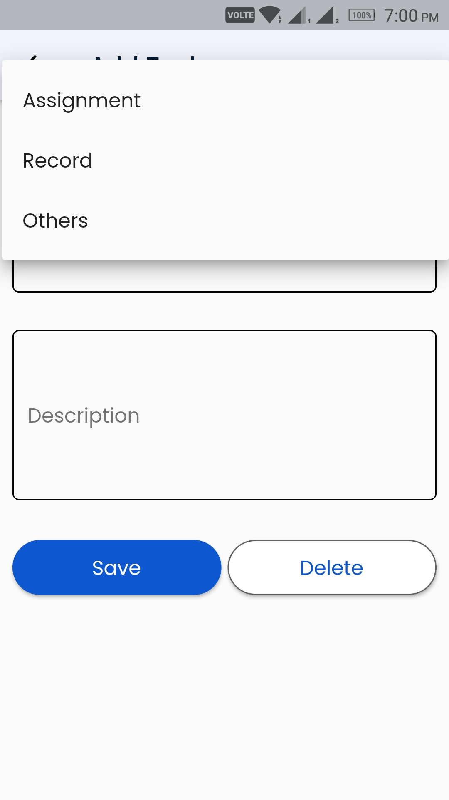
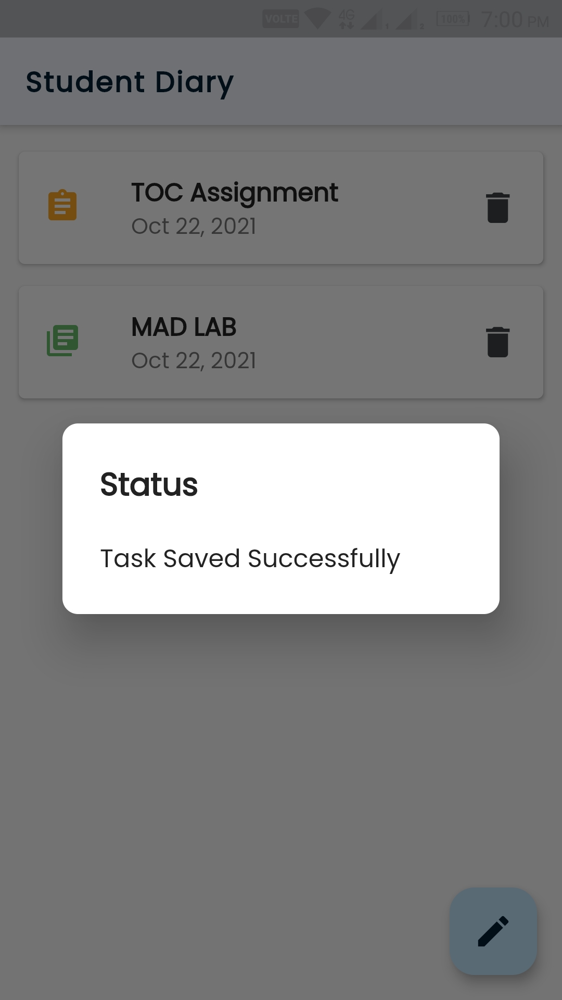

# Work Manager

This is my First Flutter project.
This is a basic TODO App made using flutter.
This app is mainly build for students to organize their works easily.

## Screenshots:
#### Home Screen :

#### Adding a new task :

#### Categories:
###### User can save their tasks in three different categories.

#### Saving a Task :

#### Homescreen View :
###### The Tasks in the homescreen are grouped by the catagories and have ther own icons along with their own color.

###### Each tile has a title and date as a subtitle and a delete icon to delete the task.

#### Deleting a Task :
###### A snackBar appears at the bottom when you delete an task.

